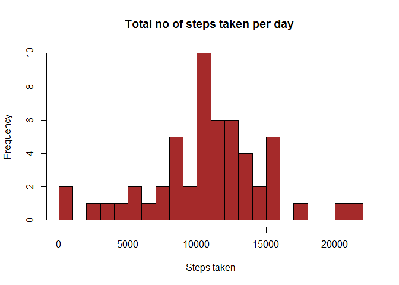
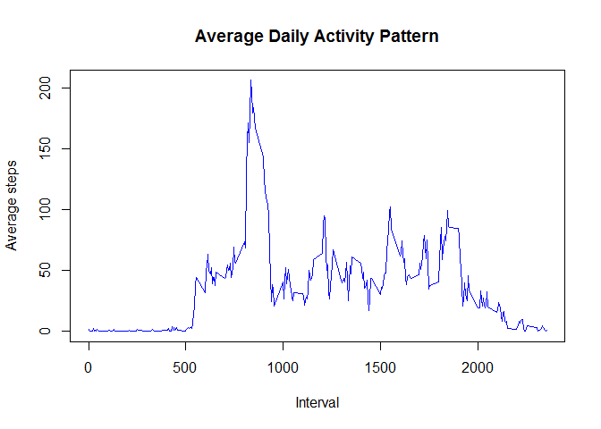
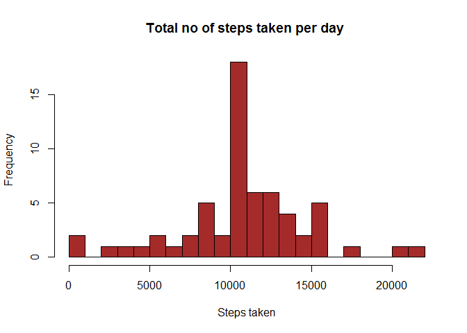
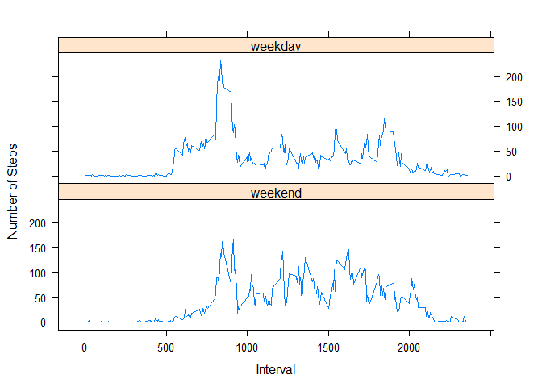

# Reproducible Research: Peer Assessment 1

# Introduction

It is now possible to collect a large amount of data about personal movement using activity monitoring devices such as a Fitbit, Nike Fuelband, or Jawbone Up. These type of devices are part of the "quantified self" movement - a group of enthusiasts who take measurements about themselves regularly to improve their health, to find patterns in their behavior, or because they are tech geeks. But these data remain under-utilized both because the raw data are hard to obtain and there is a lack of statistical methods and software for processing and interpreting the data.

This assignment makes use of data from a personal activity monitoring device. This device collects data at 5 minute intervals through out the day. The data consists of two months of data from an anonymous individual collected during the months of October and November, 2012 and include the number of steps taken in 5 minute intervals each day.

##Loading and preprocessing the data

```r
library(plyr)
#Load the data
fileHandle<-read.csv("activity.csv", stringsAsFactors = FALSE)
#Remove any missing values
totalData<-fileHandle[complete.cases(fileHandle[,1]),]
```

##What is mean total number of steps taken per day?


```r
#Calculate the total number of steps taken per day
totalStepsEachDay <- aggregate(totalData$steps, by=list(Date=totalData$date), sum)
#Make a histogram of the total number of steps taken each day
hist(
    (totalStepsEachDay$x),
    xlab="Steps taken",
    col = "brown",breaks=20,
  main="Total no of steps taken per day "
  )
```

<!-- -->

```r
#Calculate and report the mean and median of the total number of steps taken per day
mean(totalStepsEachDay$x)
```

```
## [1] 10766.19
```

```r
median(totalStepsEachDay$x)
```

```
## [1] 10765
```

##What is the average daily activity pattern?


```r
#average number of steps taken, averaged across all days
avgAllDays <- aggregate(totalData$steps, by=list(Date=totalData$interval), mean)
names(avgAllDays)=c("interval","avg_steps")
#Make a time series plot
plot(avgAllDays$interval, avgAllDays$avg_steps, type="l", main="Average Daily Activity Pattern",xlab="Interval",ylab="Average steps",  col ="blue")
```

<!-- -->

```r
#maximum number of steps in 5 minute interval
paste("Maximum Steps at interval",totalData[which.max(avgAllDays$avg_steps),]$interval)
```

```
## [1] "Maximum Steps at interval 835"
```

##Imputing missing values

```r
#Calculate and report the total number of missing values in the dataset
sum(is.na(fileHandle[1]))
```

```
## [1] 2304
```

```r
#Devise a strategy for filling in all of the missing values in the dataset - 5 minute interval is used as the strategy
for(i in 1:nrow(fileHandle))
{
  if (is.na(fileHandle[i,1]))
  {
      
    fileHandle[i,1]<- avgAllDays[which(avgAllDays$interval == fileHandle[i,3]),2]
  }
}
#total number of steps taken each day 
totalStepsEachDayWithNA <- aggregate(fileHandle$steps, by=list(Date=fileHandle$date), sum)
#Historgram
hist(
  (totalStepsEachDayWithNA$x),
  xlab="Steps taken",
  col = "brown",breaks=20,
  main="Total no of steps taken per day "
)
```

<!-- -->

```r
#Calculate and report the mean and median total number of steps taken per day
mean(totalStepsEachDayWithNA$x)
```

```
## [1] 10766.19
```

```r
median(totalStepsEachDayWithNA$x)
```

```
## [1] 10766.19
```
As per the analysis of first and third part, mean and median values are almost identical.

##Are there differences in activity patterns between weekdays and weekends

```r
library(lattice)
fileHandle$date<-as.Date(fileHandle$date)
weekdaysnames <- c('Monday', 'Tuesday', 'Wednesday', 'Thursday', 'Friday')
#Create a new factor variable in the dataset with two levels - "weekday" and "weekend" 
fileHandle$wDay <- factor((weekdays(fileHandle$date) %in% weekdaysnames), 
                   levels=c(FALSE, TRUE), labels=c('weekend', 'weekday'))

#average number of steps taken, averaged across all weekday days or weekend days
avgWeekDays <- aggregate(fileHandle$steps, by=list(Interval=fileHandle$interval,fileHandle$wDay), mean)
#Scatterplot
xyplot(avgWeekDays$x~avgWeekDays$Interval|avgWeekDays$Group.2,
       type='l',layout=c(1,2),
       xlab='Interval',ylab='Number of Steps')
```

<!-- -->


